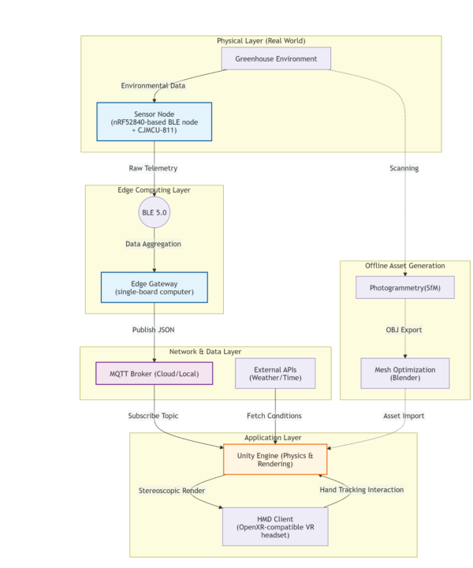
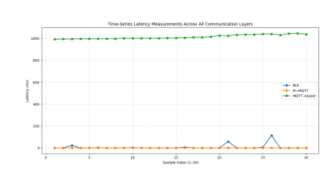
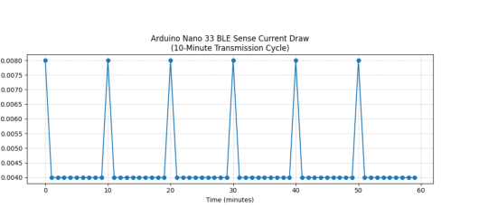
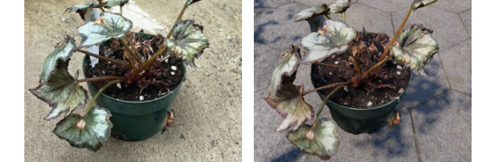
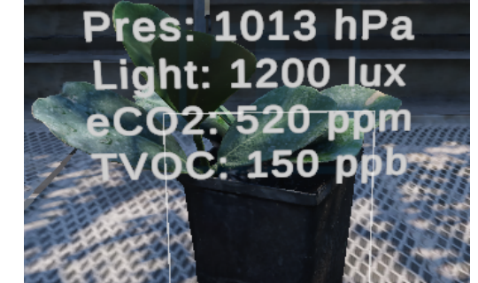
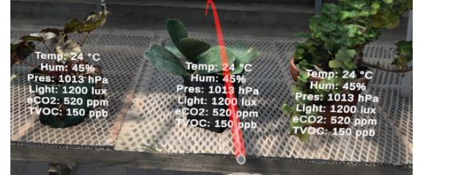

# Immersive Digital Twin Greenhouse (VR + Low-Power IoT)

Project page for a VR-based digital twin framework that streams low-power greenhouse telemetry into an OpenXR-compatible Unity client, with offline photogrammetry assets for spatial context.

Status: Under review (IEEE MDTS 2026)

## What it is
A hybrid pipeline that:
- Captures environmental data on a duty-cycled BLE sensor node
- Bridges BLE telemetry to MQTT via an edge gateway (SBC)
- Renders a photogrammetry-based greenhouse digital twin in Unity (OpenXR)
- Overlays live sensor readings directly in the VR scene for spatially grounded monitoring

## Key contributions
- Multi-layer architecture: sensing -> edge -> MQTT/data layer -> Unity/OpenXR VR client
- Duty-cycled sensing workflow for low average current draw
- End-to-end telemetry path with measured latency breakdown across links
- Qualitative validation: photogrammetry fidelity and in-scene telemetry overlays

## Architecture

## Results (highlights)
Latency time-series across communication layers:

Current draw profile over a duty-cycled schedule:

Qualitative VR visuals (telemetry overlays + reconstructed environment):

## Paper
The full manuscript is currently under review, so the PDF is not publicly mirrored here.
If/when a public version is available (publisher link or arXiv), this section will be updated.

## Contact
Mohamed Gallai
- LinkedIn: https://www.linkedin.com/in/mohamed-gallai/